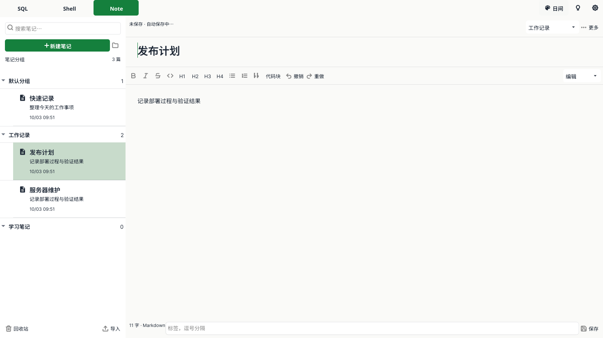

# Note 分组导航

左侧笔记导航改为“分组 → 笔记”的树形列表，替代原来的分组筛选下拉框和扁平列表。

- 默认分组和自定义分组均显示，可展开或收起；右侧显示当前视图中的笔记数量。
- 笔记在所属分组下面显示标题、摘要和更新时间，同组按更新时间降序排列。
- 点击分组后，新建笔记归入该组；选择笔记时自动展开所属分组。
- 搜索标题、正文、标签或分组名称，保留分组层级并展开匹配结果；清空搜索恢复折叠状态。
- 回收站保留分组层级；恢复笔记保留分组。移除分组后笔记归入默认分组。
- 沿用现有笔记存储格式，已有笔记无需迁移。

## 验证

笔记相关测试、分组树渲染回归测试和相关 race 测试通过；`go vet ./internal/ui`、Go 文件大小检查、`git diff --check` 通过。原生 macOS 构建成功。

使用 Fyne 软件渲染检查日间、夜间和 960×640 小窗口布局，确认分组及笔记实际可见；未调用浏览器。软件渲染不代表 AppKit 标题栏或真实鼠标事件验证。

应用与 macOS 发布包已更新，原有驱动资源记录保留。正在运行的旧进程需重新打开才能加载新版；更新未关闭正在使用的应用。
